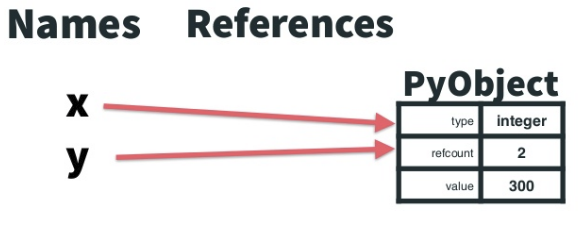
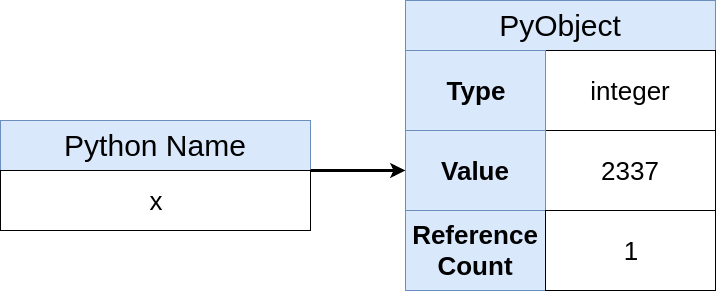
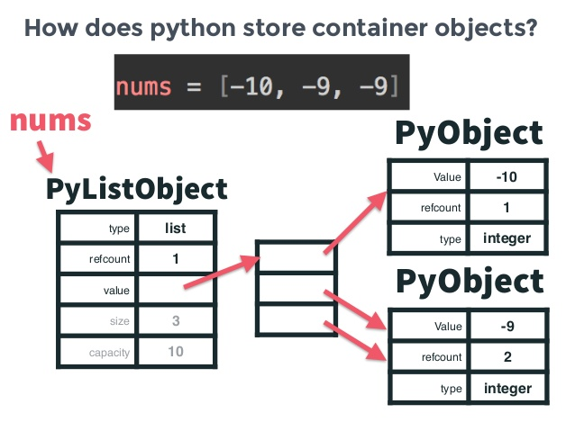
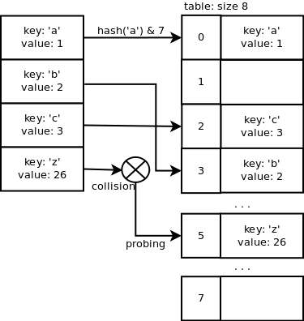
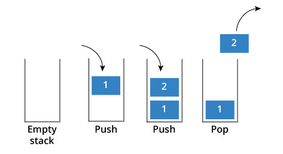
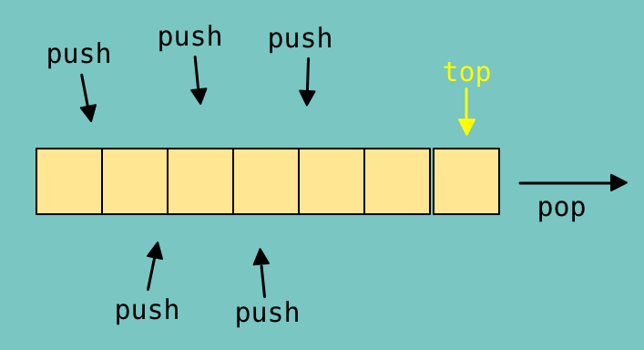
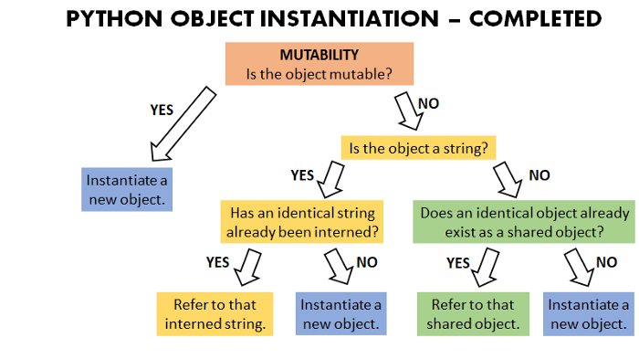

# Python 3 Data Structures Crash Course

Contains a reference of commonly used data structures in Python 3

---

## Pre-Requisites

### Assumed knowledge

- Gone through the all preceding parts of the tutorial

### Good to know

- We're using Python 3 here! Python 2 has different syntax!
- If you have knowledge of computation structures like variables, functions, OOP, etc.
- Having a rough understanding of data structures is nice too

## Table Of Contents <a name="top"></a>

1. [Introduction](#1)
2. [Python Data Structures Reference](#2)  
   2.1 [The Python Data Model](#2.1)  
   2.2 [Built-In Lists](#2.2)  
   2.3 [Built-In Tuples](#2.3)  
   2.4 [Built-In Dicts](#2.4)  
   2.5 [Built-In Sets](#2.5)  
   2.6 [Arrays/Dynamic Arrays](#2.6)  
   2.7 [Stacks](#2.7)  
   2.8 [Queues](#2.8)  
   2.9 [Priority Queues](#2.9)  
   2.10 [NamedTuple](#2.10)  
   2.11 [More Dictionaries](#2.11)  
   2.12 [Multisets](#2.12)  
   2.13 [LinkedLists](#2.13)
3. [Some Gotchas](#3)  
   3.1 [is vs ==](#3.1)  
   3.2 [Integer Interning](#3.2)  
   3.3 [String Interning](#3.3)

## 1. Introduction <a name="1"></a>

Data structures are a core computer science topic that allows one to effectively organise and manage data for efficient access and modification. Python has a couple of nice implementations of many common data structures, and we'll go through them, as well as their relevant Python implementations in this tutorial!

**This will not be an exhaustive list!**

## 2. Python Data Structures Reference <a name="2"></a>

### 2.1 The Python Data Model <a name="2.1"></a>

[go to top](#top)

> _Objects_ are Python’s abstraction for data. All data in a Python program is represented by objects or by relations between objects. (In a sense, and in conformance to Von Neumann’s model of a “stored program computer,” code is also represented by objects.)
>
> Every object has an identity, a type and a value. An object’s _identity_ never changes once it has been created; you may think of it as the object’s address in memory. The ‘[`is`](https://docs.python.org/3/reference/expressions.html#is)’ operator compares the identity of two objects; the[`id()`](https://docs.python.org/3/library/functions.html#id) function returns an integer representing its identity.
>
> <https://docs.python.org/3/reference/datamodel.html>

Everything in Python is fundamentally an object. It's part of what makes working with data in Python so easy (albeit with some overhead.)

#### **Names, References, and Objects**



[Image Source](https://www.slideshare.net/nnja/memory-management-in-python-the-basics)

When you do something like this:

```python
x = 300
y = 300
```

You're actually creating **names** that **reference** a single integer **object** the contains the value 300. In this case different names can bind to the same object because the `integer` type is fundamentally immutable.

If you did this however,

```python
x = [1]
y = [1]
```

Lists are mutable, so the names will **reference separate objects**.

Here have a nice flow chart. (Though with the caveat that strings will behave a bit differently, and will be talked about in a later section on **String Interning**)


[Image Source](https://medium.com/@bdov_/https-medium-com-bdov-python-this-is-an-object-that-is-an-object-everything-is-an-object-fff50429cd4b)

#### **Python Objects, Reference Counts, and Garbage Collection**



[Image Source](https://realpython.com/pointers-in-python/)

So every time you create a variable (hence creating a name that references a Python object), the Python object that is created or referenced to will have its **reference count** increased by 1. The PyObject also contains information about the object's type and its value. This is how types are resolved in Python!

**Python tracks how many references an object has!** Once that count hits 0, it is slated for deletion by Python's automatic garbage collector and freed from memory. This all happens in the background, and is also the reason why Python is so slow.

So now suppose we rebind x to a different value instead.

```python
x = 2338
y = 2338
```


[Image Source](https://realpython.com/pointers-in-python/)

You can see that 2337's refcount is decreased (to 0, which means it will be garbage collected eventually), and x and y now point to the PyObject for 2338, which now has a reference count of 2.

Pretty nifty eh!

### 2.2 Built-In Lists <a name="2.2"></a>

[go to top](#top)



[Image Source](https://www.slideshare.net/nnja/memory-management-in-python-the-basics)

[Reference](https://docs.python.org/3.6/library/stdtypes.html#lists)

Python lists are **variable length, heterogeneous arrays** of PyObjects. The **actual list stores references that will eventually point to the PyObjects**. Whenever you append an object, a new reference is inserted into the list.

If there is already space the list doesn't have to be resized, but if it does have to be resized, a clever implementation detail allocates extra space so you won't have to resize it until a few more appends later.

Since the Python list is in actuality a **variable length array**, it is very efficient ( _O(1)_ ) to pop or append values at the end of the array, but quite costly ( _O(n)_ ) to do so anywhere else (since all the elements need to be shifted.)

If you need to pop elements from the left size of the array, it's probably better to use some other data structure, like a deque.

Some example methods:

```python
# List instantiation
nums = [-10, -9, -9]
[x for x in range(9)] # List comprehension


# End append or pop
nums.append(1)
nums.pop()

# Indexing
nums[0]

# Insert (inefficient)
nums.insert(0, 9) # Inserts 9 at the front of the list

# Pop at index
nums.pop(0) # Removes the element at the front of the list

# Count elements
nums.count(1) # Gets you zero since there's no 1 in nums
```

### 2.3 Built-In Tuples <a name="2.3"></a>

[go to top](#top)

[Reference](https://docs.python.org/3.6/library/stdtypes.html#tuples)

Tuples are **just like lists**, except they're **immutable**, and so, once instantiated, are treated as fixed size.

Do note that they **can point to mutable objects**! But the overarching reference array will be immutable.

There are some [cool implementation details](https://stackoverflow.com/questions/14135542/how-is-tuple-implemented-in-cpython) about neat optimisations that you can read at your leisure.

```python
# Instantiation
some_tuple = (1, 2, 3)
tuple(x for x in range(3)) # Tuple comprehension

# Indexing
some_tuple[0]

# Count elements
some_tuple.count(1) # Gets you 1 since there's one 1 in the tuple
```

### 2.4 Built-In Dicts <a name="2.4"></a>

[go to top](#top)



[Image Source](https://www.laurentluce.com/posts/python-dictionary-implementation/)

[Reference](https://docs.python.org/3.6/library/stdtypes.html#dict)

Dictionaries in Python are built using hash tables. (Hash tables are different from hash maps in that they don't allow null values as keys.)

Indexing into them is _O(1)_, unless there's a collision, then it's _O(n)_.

The keys of the dictionary are supposed to be immutable objects that can be fed into a hash function. The hash is then used to point to objects in a hash table.

```python
# Instantiation
a = {'a': 1, 'b': 2}

# Indexing
a['a'] # Gets you 1

# Nifty addition trick
try:
    a['c'] += 1
except KeyError:
    a['c'] = 1
```

### 2.5 Built-In Sets <a name="2.5"></a>

[go to top](#top)

[Reference](https://docs.python.org/3.6/library/stdtypes.html#set)

Sets are like dictionaries, except they don't have values. Python implements them using dummy values.

Each element is actually a key!

Membership checking is done in _O(1)_, unless there are collisions, then it's _O(n)_, just like in dictionaries.

```python
# Instantiation
set([1, 2, 3])

# Adding to set
set.add(4)
set.add(3) # Duplicates won't be added
```

An immutable variant called a **frozenset** exists too!

```python
frozenset([1, 2, 3])
```

### 2.6 Arrays/Dynamic Arrays <a name="2.6"></a>

[go to top](#top)


[Image Source](https://jakevdp.github.io/PythonDataScienceHandbook/02.01-understanding-data-types.html)

An array is a contiguous and continuous collection of **homogeneous** elements that can be accessed by index. The index is the displacement from the start of the array. **It normally can't be resized. But dynamic arrays can provision methods to allocate new memory to resize them.**

Indexing into an array is constant time _O(1)_. Appending and popping at an array end is also constant time _O(1)_, just like with lists (since lists are actually just arrays of references.)

Similarly, removing or inserting an element anywhere else in the array will incur _O(n)_ complexity. Since all elements after the insertion index have to shift.

Types of arrays in Python include:

- [list](https://docs.python.org/3.6/library/stdtypes.html#lists)
- [tuple](https://docs.python.org/3/library/stdtypes.html#tuple)
- [array.array](https://docs.python.org/3/library/array.html)
- [str](https://docs.python.org/3/library/stdtypes.html#text-sequence-type-str)
- [bytes](https://docs.python.org/3/library/stdtypes.html#bytes-objects) (immutable array of single bytes)
- [bytearray](https://docs.python.org/3/library/functions.html#func-bytearray) (mutable array of single bytes)
- [numpy.array](https://docs.scipy.org/doc/numpy/reference/generated/numpy.array.html)
  - Highly recommended! These are blazingly fast for numeric data

### 2.7 Stacks <a name="2.7"></a>

[go to top](#top)



[Image Source](http://bluegalaxy.info/codewalk/2018/08/12/python-how-to-implement-a-lifo-stack/)

Abstract data structure that contains elements. Adheres to LIFO (Last In, First Out.)

You could implement your own in Python, **or** you could use a pre-existing data structure.

- [list](https://docs.python.org/3/tutorial/datastructures.html#using-lists-as-stacks)

  - Make sure you don't accidentally pop or insert anywhere other than at the end! Otherwise you'll break the stack behaviour and also go from _O(1)_ complexity to _O(n)_

- [collections.deque](https://docs.python.org/3/library/collections.html#collections.deque)

  - **Recommended** linked-list implementation of a double-ended queue, which can be used as a stack if you just append and pop from the right side! The behaviour of the deque actually prevents you from accidentally breaking the stack behaviour. These also support **thread-safe behaviour!**

    ```python
    collections.deque([1, 2, 3])
    ```

- [queue.LifoQueue](https://docs.python.org/3/library/queue.html)

  - Also good for threaded use. It implements all the locking semantics.

    ```python
    # Instantiate
    a = queue.LifoQueue()

    a.put(1)
    a.get()
    ```

> **Note**: Though the collections.deque implementation uses a linked list, you can't treat it like a linked list since the ability for you to insert items in the middle of the linked list is abstracted away by the deque implementation.

### 2.8 Queues <a name="2.8"></a>

[go to top](#top)


[Image Source](https://www.fluentcpp.com/2018/03/20/heaps-and-priority-queues-in-c-part-3-queues-and-priority-queues/)

Abstract data structure that contains elements. Adheres to FIFO (First In, First Out.)

You can also have a double ended variant called a deque!

- [collections.deque](https://docs.python.org/3/library/collections.html#collections.deque)

  - **Recommended**! Implemented using linked lists (explained later)

    ```python
    a = collections.deque([1, 2, 3])

    a.append(1)
    a.appendleft(2)

    a.pop()
    a.popleft()
    ```

- [queue.queue](https://docs.python.org/3/library/queue.html)

- [multiprocessing.Queue](https://docs.python.org/3/library/multiprocessing.html#multiprocessing.Queue)

  - Good for cross process information sharing

### 2.9 Priority Queues <a name="2.9"></a>

[go to top](#top)



[Image Source](https://www.fluentcpp.com/2018/03/20/heaps-and-priority-queues-in-c-part-3-queues-and-priority-queues/)

Just like queues, except FIFO isn't adhered to. Only the 'top' element will be shoved to the front of the queue to be popped next. They're an **abstract data type**.

What 'top' means depends on the specific implementation. Top could mean things like highest or lowest value depending on some value determining function.

The common modules used to implementing priority queues implement them using [heaps](https://www.youtube.com/watch?v=t0Cq6tVNRBA). Which can be implemented using lists!

- [heapq](https://docs.python.org/3/library/heapq.html)

  - ```python
    import heapq

    # Instantiate a new heap
    q = []

    # Or create a heap from a pre-existing list!
    a = [1, 4, 12, 531, 2, 314]
    heapq.heapify(a)

    heapq.heappush(q, 1)
    heapq.heappush(q, 2)
    heapq.heappush(q, 3)

    # Get the smallest item
    heapq.heappop(q)
    ```

  - Note that the **default** heap format for heapq is the **min heap.** That is, all top values will be the smallest. For **max heap**, you can multiply your keys by `-1` or...

    ```python
    heapq.nlargest(3, q) # Get the top 3 values
    ```

    There are [some other ways to get around this](https://stackoverflow.com/questions/2501457/what-do-i-use-for-a-max-heap-implementation-in-python)

- [queue.PriorityQueue](https://docs.python.org/3/library/queue.html#queue.PriorityQueue)

  - This one wraps heapq with a nicer interface. Still uses a **min heap** though!

    ```python
    from queue import PriorityQueue

    q = PriorityQueue()

    q.put((2, 'code'))
    q.put((1, 'eat'))
    q.put((3, 'sleep'))

    next_item = q.get() # (1, 'eat')
    ```

### 2.10 NamedTuple <a name="2.10"></a>

[go to top](#top)

Just like tuples, but with named arguments for easier maintainability!

- [collections.namedtuple](https://docs.python.org/3/library/collections.html#collections.namedtuple)

  - ```python
    from collections import namedtuple

    some_tuple = namedtuple('name_of_the_tuple', 'a b c')

    tuple_instance_1 = some_tuple(1, 2, 3)

    # Now tuple_instance_1 is...
    # name_of_tuple(a=1, b=2, c=3)

    # You can index into it
    tuple_instance_1[0]

    # Or by member!
    tuple_instance_1.a
    ```

### 2.11 More Dictionaries <a name="2.11"></a>

[go to top](#top)

Yep.

- [collections.OrderedDict](https://docs.python.org/3/library/collections.html#collections.OrderedDict)

  - This dictionary remembers insertion order. This becomes a language feature from Python 3.6 onwards, but for backwards compatibility you can still use this explicitly.

    ```python
    import collections

    a = collections.OrderedDict()
    a['a'] = 2 # Insert key-value
    a[1] = 1 # Same thing here

    # They're all ordered!
    a # OrderedDict([('a', 2), (1,1)])

    # To retrieve the stuff in order, you can just use list()
    # This one returns a list of keys
    list(a)

    # For items,
    list(a.items())

    # And for values
    list(a.values())
    ```

- [collections.defaultdict](https://docs.python.org/3/library/collections.html#collections.defaultdict)

  - Explicitly set what default values are set when a dictionary key that doesn't exist is indexed into

    ```python
    from collections import defaultdict
    a = defaultdict(list)

    a['a'].append(1)

    # Now a is defaultdict(list, {'a': [1]})
    # Wow!

    # The alternative would be to do this instead with the native dictionary
    b = {}

    try:
        b['a'].append(1)
    except KeyError:
        b['a'] = [1]
    ```

- [collections.ChainMap](https://docs.python.org/3/library/collections.html#collections.ChainMap)

  - Combine dictionaries wrt. indexing. But when adding new keys, it only affects the first dictionary.

    ```python
    from collections import ChainMap

    dict_1 = {'one': 1, 'two': 2}
    dict_2 = {'three': 3, 'four': 4}
    chain = ChainMap(dict_1, dict_2)

    chain["three"] # 3

    # Natively, you can merge dictionaries just by doing this
    a = {}
    a.update(dict_1)
    a.update(dict_2)
    ```

### 2.12 Multisets <a name="2.12"></a>

[go to top](#top)

There's a multiset (a set that can have duplicate keys, so the keys aren't unique) implementation in the collections module.

- [collections.Counter](https://docs.python.org/3/library/collections.html#collections.Counter)

  - ```python
    from collections import Counter

    a = Counter()
    a.update({'a': 1})
    a.update({'a': 1})

    a # Counter({'a': 2})

    # The native Python method would be to initialise the key, then increment it if it exists
    ```

Coolio.

### 2.13 LinkedLists <a name="2.13"></a>

[go to top](#top)


[Image Source](https://www.interviewbit.com/courses/programming/topics/linked-lists/)

A linked list is not actually a Python list like structure. Instead it's a collection of linked list nodes that contain values, and the memory address of the next node in the sequence.

Sometimes they also contain the memory address of the previous node, and that variant is called a **doubly linked list**.

Because of this structure, removals and insertions anywhere are _O(1)_, but iterating through them are _O(n)_.

So you'd use this or a hash map instead when you need lots of insertions and deletions in the middle or start of the sequence.

There's no native inbuilt linked list class that grants the full features of linked lists in Python. But we can define our own.

**Singly Linked List**

```python
# Source: https://dbader.org/blog/python-linked-list

class ListNode:
    """
    A node in a singly-linked list.
    """
    def __init__(self, data=None, next=None):
        self.data = data
        self.next = next

    def __repr__(self):
        return repr(self.data)


class SinglyLinkedList:
    def __init__(self):
        """
        Create a new singly-linked list.
        Takes O(1) time.
        """
        self.head = None

    def __repr__(self):
        """
        Return a string representation of the list.
        Takes O(n) time.
        """
        nodes = []
        curr = self.head
        while curr:
            nodes.append(repr(curr))
            curr = curr.next
        return '[' + ', '.join(nodes) + ']'

    def prepend(self, data):
        """
        Insert a new element at the beginning of the list.
        Takes O(1) time.
        """
        self.head = ListNode(data=data, next=self.head)

    def append(self, data):
        """
        Insert a new element at the end of the list.
        Takes O(n) time.
        """
        if not self.head:
            self.head = ListNode(data=data)
            return
        curr = self.head
        while curr.next:
            curr = curr.next
        curr.next = ListNode(data=data)

    def find(self, key):
        """
        Search for the first element with `data` matching
        `key`. Return the element or `None` if not found.
        Takes O(n) time.
        """
        curr = self.head
        while curr and curr.data != key:
            curr = curr.next
        return curr  # Will be None if not found

    def remove(self, key):
        """
        Remove the first occurrence of `key` in the list.
        Takes O(n) time.
        """
        # Find the element and keep a
        # reference to the element preceding it
        curr = self.head
        prev = None
        while curr and curr.data != key:
            prev = curr
            curr = curr.next
        # Unlink it from the list
        if prev is None:
            self.head = curr.next
        elif curr:
            prev.next = curr.next
            curr.next = None

    def reverse(self):
        """
        Reverse the list in-place.
        Takes O(n) time.
        """
        curr = self.head
        prev_node = None
        next_node = None
        while curr:
            next_node = curr.next
            curr.next = prev_node
            prev_node = curr
            curr = next_node
        self.head = prev_node
```

**Doubly Linked List**

```python
# Source: https://dbader.org/blog/python-linked-list

class DListNode:
    """
    A node in a doubly-linked list.
    """
    def __init__(self, data=None, prev=None, next=None):
        self.data = data
        self.prev = prev
        self.next = next

    def __repr__(self):
        return repr(self.data)


class DoublyLinkedList:
    def __init__(self):
        """
        Create a new doubly linked list.
        Takes O(1) time.
        """
        self.head = None

    def __repr__(self):
        """
        Return a string representation of the list.
        Takes O(n) time.
        """
        nodes = []
        curr = self.head
        while curr:
            nodes.append(repr(curr))
            curr = curr.next
        return '[' + ', '.join(nodes) + ']'

    def prepend(self, data):
        """
        Insert a new element at the beginning of the list.
        Takes O(1) time.
        """
        new_head = DListNode(data=data, next=self.head)
        if self.head:
            self.head.prev = new_head
        self.head = new_head

    def append(self, data):
        """
        Insert a new element at the end of the list.
        Takes O(n) time.
        """
        if not self.head:
            self.head = DListNode(data=data)
            return
        curr = self.head
        while curr.next:
            curr = curr.next
        curr.next = DListNode(data=data, prev=curr)

    def find(self, key):
        """
        Search for the first element with `data` matching
        `key`. Return the element or `None` if not found.
        Takes O(n) time.
        """
        curr = self.head
        while curr and curr.data != key:
            curr = curr.next
        return curr  # Will be None if not found

    def remove_elem(self, node):
        """
        Unlink an element from the list.
        Takes O(1) time.
        """
        if node.prev:
            node.prev.next = node.next
        if node.next:
            node.next.prev = node.prev
        if node is self.head:
            self.head = node.next
        node.prev = None
        node.next = None

    def remove(self, key):
        """
        Remove the first occurrence of `key` in the list.
        Takes O(n) time.
        """
        elem = self.find(key)
        if not elem:
            return
        self.remove_elem(elem)

    def reverse(self):
        """
        Reverse the list in-place.
        Takes O(n) time.
        """
        curr = self.head
        prev_node = None
        while curr:
            prev_node = curr.prev
            curr.prev = curr.next
            curr.next = prev_node
            curr = curr.prev
        self.head = prev_node.prev
```

## 3. Some Gotchas <a name="3"></a>

### 3.1 is vs == <a name="3.1"></a>

[go to top](#top)

The `is` operator checks for the equivalency of the `id`s of objects being checked.

```python
a is b

# Is equivalent to
id(a) == id(b)
```

As such, you are advised **not to use the is operator** on anything other than singletons, like `None`, or if you explicitly want to check for the equality of object addresses.

For anything else, please use `==` unless you want weird behaviour, some of the reason for which we'll go through in the next few sections.

### 3.2 Integer Interning <a name="3.2"></a>

[go to top](#top)

```python
a = 256
b = 256

a == b # True
a is b # True

c = 10000
d = 10000

c == d # True
c is d # False (Wait what?)
```

The reason for this is because Python actually interns small integers (what this means depends on the distribution, but in the case of Python 3, it interns all integers between -5 and 256.)

What this means is that at compilation time, Python actually instantiates a list of PyObjects representing all the numbers from -5 to 256. So when you use those numbers you will immediately just reference the numbers in that list.

This is why the `a is b` expression evaluates to `True`. Since the objects being referenced to are truly the same.

In the case for `c` and `d`, however, new, unique objects are being instantiated. And hence their ids point to different objects. So even though the values are the same, the `is` operator causes an evaluation to `False`.

### 3.3 String Interning <a name="3.3"></a>

[go to top](#top)



[Image Source](https://medium.com/@bdov_/https-medium-com-bdov-python-objects-part-iii-string-interning-625d3c7319de)

**ahem**. Since strings are widely used as identifiers, Python has an optimisation trick called **string interning** to try to save space and re-instantiation time.

What this means is that **certain strings are actually interned, and saved in a list, and any future instantiations of those strings simply create a reference to the stored string, as opposed to instantiating a new object**!

This is bad news for anyone who isn't aware of this and abuses the `is` operator. But now you know.

For what **specifically counts as a suitable string for interning, check out this flowchart!**


[Image Source](https://medium.com/@bdov_/https-medium-com-bdov-python-objects-part-iii-string-interning-625d3c7319de)

Let's check out some examples.

```python
a = "methylDragon"
b = "methylDragon"

a is b # True, since both are interned

c = "methylDragon"
d = str(["m", "e", "t", "h", "y", "l", "D", "r", "a", "g", "o", "n"])

c is d # False! D is not compile-time constant

e = "a!"
f = "a!"

e is f # False! They have non-ascii characters and are longer than length 1
```

This last one is a doozy though

```python
f = "" + "a"
g = "a"

f is g # True! Empty strings are interned.
```

**Bottom line, just use equality operators `==` instead of `is` to save yourself the headache...**

**CH3EERS!**

```
                            .     .
                         .  |\-^-/|  .
                        /| } O.=.O { |\
```

​

---

[.png>)](https://www.buymeacoffee.com/methylDragon)
